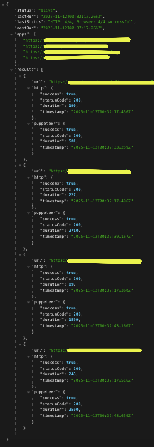

# Puppeteer Pinger

Keeps your Render.com apps alive by visiting them with a real browser at configurable intervals. This generates actual external HTTP traffic that prevents Render's free tier apps from spinning down.

## How It Works

1. Runs on Render as a Docker web service
2. At your configured interval (default 10 minutes):
   - **First**: Sends lightweight HTTP GET requests to all apps in parallel
   - **Then**: Waits 10 seconds (configurable)
   - **Finally**: Launches Puppeteer browser and opens all apps in separate tabs
3. Keeps all browser tabs open for 3 minutes (configurable)
4. Tracks and displays results from both HTTP requests and browser visits in the health check endpoint
5. Both methods provide redundancy to keep apps active

### Dual-Method Approach

This app uses **two complementary methods** to keep apps alive:

**HTTP Requests (Quick & Lightweight):**

- Fast parallel GET requests to all URLs
- Minimal resource usage
- Quick initial ping to wake up apps

**Puppeteer Browser Visits (Thorough & Sustained):**

- **Actually visits the page** like a real user, not just a quick GET request
- **Executes JavaScript** - fully loads your React/Vue/Node app
- **Stays on the page** for minutes, not milliseconds
- **Keeps connections alive** - generates sustained server activity
- **Opens multiple tabs** - keeps all apps warm simultaneously

The combination ensures maximum reliability - HTTP requests provide fast pings while the browser maintains sustained activity.

## Setup

### 1. Local Testing (Optional)

Copy the example environment file and configure it:

```bash
cp .env.example .env
```

Then edit `.env` with your configuration:

```
PING_URLS=http://localhost:3000, https://your-app.onrender.com
PING_INTERVAL_MIN=5
PAGE_WAIT_SEC=180
HTTP_TO_BROWSER_DELAY_SEC=10
HTTP_TIMEOUT_SEC=30
DISCORD_WEBHOOK=https://discord.com/api/webhooks/YOUR_WEBHOOK_URL
```

Run the app:

```bash
npm install
npm start
```

Visit `http://localhost:3000` to see status or `/ping-now` to trigger a test cycle.

### 2. Deploy to Render

1. **Push to GitHub:**

   ```bash
   git init
   git add .
   git commit -m "Initial commit"
   git branch -M main
   git remote add origin YOUR_GITHUB_REPO_URL
   git push -u origin main
   ```

2. **Create Web Service on Render:**

   - Go to [Render Dashboard](https://dashboard.render.com/)
   - Click "New +" → "Web Service"
   - Connect your GitHub repo
   - Configure:
     - **Name:** `puppeteer-pinger`
     - **Environment:** `Docker`
     - **Instance Type:** `Free`
     - **Auto-Deploy:** `Yes`

3. **Add Environment Variables:**
   After deployment, add these in the Render dashboard (Environment tab):

## Configuration

All configuration is done via environment variables in Render.

### Required Variables

- `PING_URLS` - Comma-separated list of URLs to ping (spaces after commas are fine)
  - Example: `https://app1.onrender.com, https://app2.onrender.com, https://app3.onrender.com`
  * \* **_Tip: Add the deployed Puppeteer-Pinger URL to `PING_URLS` as well so that it can ping itself and prevent spindown_**
- `PING_INTERVAL_MIN` - How often to ping in minutes (default: 10)
- `PAGE_WAIT_SEC` - Seconds to keep all tabs open (default: 180, ensures full spin-up)

### HTTP Request Configuration (Optional)

- `HTTP_TIMEOUT_SEC` - Timeout for HTTP requests in seconds (default: 30)
- `HTTP_TO_BROWSER_DELAY_SEC` - Delay between HTTP requests completing and browser launch in seconds (default: 10)

### Discord Notifications (Optional)

Get notified in Discord when apps fail to respond:

- `DISCORD_WEBHOOK` - Discord webhook URL

**How to get a Discord webhook:**

1. Open Discord and create a server (or use existing)
2. Right-click a channel → Edit Channel → Integrations
3. Click Webhooks → New Webhook → Copy Webhook URL

If webhook is not set, the app works normally without notifications.


Example:

```
PING_URLS=https://puppeteer-pinger.onrender.com, https://your-other-app.onrender.com
PING_INTERVAL_MIN=10
PAGE_WAIT_SEC=180
HTTP_TIMEOUT_SEC=30
HTTP_TO_BROWSER_DELAY_SEC=10
DISCORD_WEBHOOK=https://discord.com/api/webhooks/YOUR_WEBHOOK_URL
```

## Endpoints

- `GET /` - Health check endpoint showing:
  - Last run time and next scheduled run
  - Overall status summary
  - Detailed results for each URL including:
    - HTTP request status code, duration, and success
    - Browser visit status code, duration, and success
- `GET /ping-now` - Manually trigger a ping cycle (for testing)



## Features

- **Dual ping method**: HTTP requests + browser visits for maximum reliability
- Configurable ping interval (default: 10 minutes)
- Configurable list of URLs to monitor
- HTTP requests sent in parallel for speed
- Opens all apps in parallel browser tabs for efficiency
- Configurable wait time to ensure full spin-up
- Configurable delay between HTTP and browser methods
- First ping starts 30 seconds after deployment
- Detailed logging with timestamps and durations
- JSON health check endpoint with full result tracking
- Error handling for individual app failures
- Discord notifications when apps fail (optional)
- Docker container with all Chrome dependencies
- Works around Render's inactivity spin down

## How It Keeps Apps Alive

When Render apps on the free tier have no external traffic for 15 minutes, they spin down. This app:

1. Pings itself and other apps with HTTP requests (external traffic)
2. Follows up with Puppeteer browser visits (sustained activity)
3. Runs at your configured interval (default 10 minutes, before 15-minute timeout)
4. Dual-method approach ensures apps stay active and responsive

## Troubleshooting

**Apps still spinning down:**

- Check Render logs to ensure pings run every 10 minutes
- Verify all URLs are correct and accessible
- Make sure the app is pinging itself

**Puppeteer errors:**

- Dockerfile includes all Chrome dependencies
- Render automatically detects Dockerfile and builds correctly
- Check logs for specific error messages

**Timeout errors:**

- Increase `TIMEOUT_MS` in index.js
- Some apps may take longer to wake up from sleep

## Tech Stack

- Node.js 18
- Express
- Puppeteer (headless Chrome)
- Docker

## License

[LICENSE](LICENSE)

Copyright (c) 2025 DevManSam
